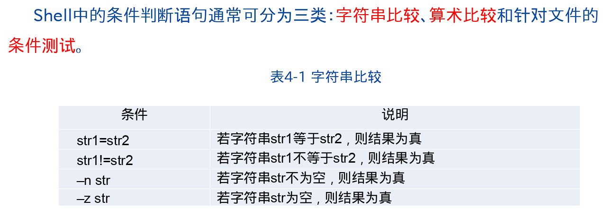

# Linux常用版本

linux常用的版本：Ubuntu(乌班图)、RedHat(红帽)、CentOS....


# linux优缺点


# linux网络管理与通信

## 网络管理

### ifconfig

ifconfig  查看网关

### netstat

命令格式： netstat [选项]


### ping

命令格式: ping [选项] [参数]


### 配置动态ip


访问测试 

- ping命令  按Ctrl + C停止

## 网络通信

### write 

功能：使当前用户向另一个用户发送信息

命令格式：write 用户名

### wall

功能：使当前用户向所有用户发送信息

命令格式：wall

# linux的目录结构

- linux只有一个根目录（只有一个盘）：/ 
  - 它的根就是“/”

- 层级式的目录结构
  - 根下面有很多子目录
- bin ->usr/bin (相当于windows的path变量 哪个盘都可以执行): 
  - 存放系统预装的可执行程序，这里存放的可执行文件可以在系统的**任何目录**下执行。

- usr/local/bin
  - 存放用户自己的可执行文件，他当中的内容，也是**任何目录**下执行

- etc
  - 存放系统用到的配置文件，例如*配置环境变量*。（/etc/profile）

- home
  - 每一个用户根目录，默认情况下，目录名和自己的用户名相同
  - 用来保护用户的私人数据

- opt（相当于Windows的Program files(X86)）
  - 给linux额外安装软件所存放的目录，比如你安装一个Oracle数据库则就可以放到这个目录下，默认为空。

# linux远程操作

- xshell:终端模拟软件安装并破解

1. 启动xshell.exe	

2. 链接远程linux系统

   1. 新建会话

   2. 查看linux的ip地址：**ifconfig**: 192.168.186.128


- Xftp：文件传输软件
  1. 安装并破解
  2. 同上

# Linux常用工具(vi/GCC/GDB)


## 文本编译 vi/vim


- vi和vim（记事本）
  - 查看和编辑文本文件
  - vim是vi的加强版，vi的绝大多数用法在vim都适用
  - vi和vim的使用：
    - 一般模式：用vi或vim命令打开文件（vim test.txt）进入一般模式；可以查看内容不可以编辑
    - 编辑模式：在一般模式下按“i”或者“a” 都可以进入编辑模式，但是不能保存
      - 按Esc回到一般模式 
    - 命令模式：在一般模式，按“ ：”，进入到命令模式
      - q!-----表示不保存，强制退出编译器
      - wq------保存并退出
      - q--------只是退出编辑器
    - 快捷键：
      - 复制当前行：yy
      - 粘贴：p
      - 复制当前行往下5行 按  5yy
      - 搜索：命令行模式：输入/然后输入要查找的关键字，回车 。按 n 表示光标查找下一个关键字
      - 删除当前行：一般模式下按 dd  
      - 删除当前行往下5行：按 5dd
      - 撤销： 一般模式按 u
      - 显示行号：命令行模式：set nu
      - 取消行号：命令模式： set nonu

### 命令模式--删除


### 命令模式--复制粘贴


### 命令级别


### 插入模式


### 底行模式


### 模式转换


### vi编辑器的配置


## GCC编辑器


### 编译流程


### 文件编译


## GDB调试工具


# 用户管理

- 添加用户：useradd +用户名  ;useradd zhangsan
  - 
  - 
- 创建用户的同时 指定其根目录：useradd -d /home/ww  wangwu'创建wangwu 指定到home目录下的ww
- 给用户设置密码：passwd 用户名 例如 passwd lisi 
  - 
  - 
  - 
- 删除用户：userdel 用户名       userdel lisi
- 删除用户的同时，级联删除它的主目录 ：userdel -r lisi
  - 
- 修改用户账号
  - 
  - 例子：usermod -u 678 jim 修改jim的id为678

- 查看用户信息： id 用户名
- 切换用户：su 用户名
  - 
  - 
- sudo命令
  - 
  - 

# 组管理

- 添加组：groupadd 组名
  - 
- 删除组：groupdel 组名
  - 
- 修改用户组属性
  - 
- 把用户添加到组中：gpasswd -a 用户名 组名
  - gpasswd -a zhangsan dev
- 把用户从组中移除：gpasswd -d 用户名 组名
  - gpasswd -d zhangsan dev
- 创建用户时指定所属的组（主组）：useradd -g 组名 用户名
  - useradd -g dev lisi

# linux系统操作

- 关机 ：
  - shutdown now 立即关机
  - shutdown -h xxx 定时关机
  - shutdown -r now 立即重启
- 重启  reboot 立即重启
- 同步数据库 sync

# 帮助命令（man、info、whatis、whoami）

## man

- 用来查看linux系统手册(manpage)的帮助信息：
- 格式： man 命令、配置文件
- 例子
  - man  ls (ls是要查询的配置文件)
  - 分屏显示、按回车翻一页、按空格翻页、按 q退出查看


## info


- help 命令：用来查看命令的内置帮助信息

## whatis和whoami


# 文件和目录操作命令

## pwd--- 查看当前所在目录

- 查看当前所在目录：pwd

## ls ---查看指定目录

- 查看指定目录下所有的子目录或者文件列表： ls [指定目录]

  - ls /home
  - ls -l /home 文件以列表的形式展示
  - ls -a /home :显示指定目录下所有的子目录和文件（包括虚拟目录）
  - ls -al /home 以列表的形式显示指定的目录包括虚拟目录
  - 
  - ls -l  ---查看文件的所有者和所在的组
  - ls -a ---查看隐藏目录

## cd ---切换目录

- 切换目录 cd 目录名
- 绝对目录<以盘符开始>
    - cd /opt/testDir
    -  ~ ：当前用户的根目录 
  - 相对目录<以目录名开始的目录>
    -  .. :当前目录的上一级目录
    -  .  :当前目录

## mkdir ---创建目录

- 创建目录： mkdir [选项] 目录名

  在/opt/testDir下建立目录

  - 绝对目录

    - mkdir /opt/testDir/test1

  - 相对目录

    - mkdir test2  (在当前目录下创建)

  - 创建多级目录

    //在/opt/testDir下创建test3，并且在test3下面创建test4

    - mkdir -p /opy/testDir/test3/test4
  
- 

## rmdir ---删除空目录

- 删除一个空目录 ：rmdir 目录名

## touch ---创建文件

- 创建文件  touch 文件名列表（文件名之间用空格隔开）
  - vi/vim创建文件后会自动打开，并且一次只能创建一个文件
  - touch 创建空文件 ，可创建多个文件
    - touch t1.txt
    - touch t1.txt t2.txt t3.txt

## cp ---复制文件

- 复制文件/目录 ：cp source (源) dest(目标)
  - cp t1.txt test    //t1.txt复制到test目录
  - cp test2 test5 只能复制一个文件过去，如果test2是个文件夹，那么这个方法不适用
  - cp -r test2 test5   //把test2复制到test5（递归的复制）


## rm ---删除文件

- 删除文件/目录： rm 文件名或目录名
  - 删文件
    - rm t1.txt 提示删除
    - rm -f t2.txt 强制删除
  - 删目录
    - rm -r test2 提示递归删除目录
    - rm -rf test2 强制递归删除目录
  
  

## mv ---移动文件

- 移动目录、文件（剪切）：mv source(源) dest(目标)
  - mv test.txt test1
  - 移动多个文件至目录 mv t3.txt t4.txt test
  - mv t3.txt   t3_new.txt (文件重命名)
  - *如果目标已经存在该文件或者目录，则会提示是否覆盖*

# 查看文件

## cat ---查看文件内容

- 查看文件内容： cat 文件名 文件内容一次性显示出来
  - cat t4.txt
  - cat -n t4.txt 显示行号

## more ---分页查看文件内容

- 分页查看文件文件内容：more 文件名  一次性加载文件所有内容到内存，分页显示
  - 按回车翻一行，按空格翻一页
  - more t4.txt


## less ---分页查看文件内容

- 分页查看文件文件内容：less 文件名 分页加载文件所有内容到内存，分页显示
  - less指令用来分屏查看文件内容，它的功能与more指令类似，但是比more指令更加强大，支持各种显示终端。less指令在显示文件内容时，并不是一次将整个文件加载之后才显示，而是根据显示需要加载内容，对于**显示大型文件**具有较高的效率
  - less t4.txt
  - 按回车翻一行 空格翻一页 按q退出查看

## head ---查看文件的头10行

- 查看文件的头10行 ：head [选项] 文件名
  - head t4.txt
  - head -10 t4.txt

## tail ---查看文件的后10行

- 查看文件的后10行 tail [选项] 文件名
  - tail t4.txt
  - tail -10 t4.txt

### echo ---输出系统变量

- echo:输出系统变量或者常量值到命令终端
  - echo $JAVA_HOME

### > ---查看命令结果输出指定文件

- " > "指令：ls > res.txt
  - 把前一个查看命令的结果输出到指定的文件中：查看命令 >  文件名  （查看命令 cat more less head  等等）
  - 如果目标文件不存在，则自动创建一个
  - cat res.txt > t3.txt 文件内容的复制（覆盖）

### date ---时间日期操作

- linux中关于日期和时间的操作命令
  - 查看或设置系统的日期或者时间 ： date
    - date 查看当前的完整的日期和时间
    - date +%Y 系统当前的年份
    - date +%m 系统当前的月份
    - date +%d 系统当前的日期
    - date '+%Y-%m-%d %H:%M:%S'  显示年月日时分秒
    - date -s '2022-8-9 22:29:30' 设置当前的系统时间

### cal ---查看系统日历

- 查看系统日历 cal 
  - cal :查看当前月份的日历
  - cal 2022:查看指定年份的日历

# 查找文件

## find ---搜索文件

- linux中关于搜索文件或目录的命令：find [搜索范围] [搜索标准] 关键字
  - -> -name 默认按名称搜索
    - 搜索所有txt文件
      -  find *.txt
    - 搜索所有含有e的文件或目录
      - find * e* 
    - 搜索所有etc目录下，所有的指定文件
      - find /etc  *.txt
  - -> -size 按文件大小搜索
    - 搜索文件大于5M的文件
      - find /etc -size +5M
    - 搜索文件小于5M的文件
      - find /etc -size -5M
  - -> -user 按文件的所有者搜索
    - 搜索/etc目录下所有的所有者是zhangsan的文件和目录
      - find /etc -user zhangsan

## loacte ---搜索

- 在整个**目录树**搜索文件或目录 d都是根据名称搜索，效率高
  - 需要先同步数据库，再搜索
    1. updatedb  同步数据库
    2. locate *.txt

## locate和find的区别


## which--搜索

Which在当前环境变量PATH查找 一般用于查找命令/可执行文件的所在路径

命令格式:  which 命令

- which yum 
-  which ls

## whereis--搜索

## grep--搜索

命令格式 ： grep 指定字符 源文件

eg： grep itheima  /etc/passwd

即：找到/etc/passwd文件下 有itheima  的这一行


### | grep ---搜索过滤命令

- 在前一个搜索命令的结果中进行按名称进一步过滤:
  - 搜索命令 |grep 过滤条件
    - 搜索当前目录下，所有包含new的.txt文件
      - find *.txt |grep new
      - find /etc -size -5k |grep firefox
  - 查看命令 |grep 过滤条件
    - 查看t1.txt文件中有beijing的内容
      - cat t1.txt |grep beijing
    - 不区分大小写 -i
      - cat t1.txt | grep -i beijing
    - 显示行号
      - cat t1.txt | grep -n beijing
    - n i组合使用
      - cat t1.txt | grep -ni beijing
    - 当前目录下所有的名字里含new的子目录和文件
      - ls -al | grep new

# 压缩和解压

## gzip gunzip--压缩解压

- 压缩或解压**单个文件**：
- gzip 文件名：压缩单个文件,生成一个.gz的压缩包，并且会把原来的文件删除
    - gzip ret.txt
  - gunzip .gz压缩包名： 解压.ge压缩包，并且把原来  .gz压缩包删除
    - gunzip ret.txt.gz


## zip和unzip

- 压缩并且打包或解压**多个文件和目录**
- zip 目标压缩包名称(通常使用.zip)  文件或目录列表 ：
    - 将ret.txt t1.txt test2  打包和压缩至test.zip
      - zip test.zip ret.txt t1.txt test2 
  - unzip  压缩包名(.zip) -d 解压目录名：
    - 将.zip压缩包解压到当前目录
      - unzip test.zip
    - 将.zip压缩包解压到指定目录
      - unzip test.zip -d test3


## bzip2和bunzip2


## tar

- 压缩（打包）或者解压**多个文件和目录**

  - tar [选项] 目标压缩包名称（xxx.tar.gz）文件或者目录列表

    - -c：产生.tar.gz打包文件

      -v：显示详细信息

      -f：指定压缩后的文件名

      -z：打包同时通过gzip指令压缩备份文件，压缩后格式为.tar.gz

      -x：解压.tar.gz文件

      -C: 指定解压到哪个目录

      - *tar [选项] 压缩包名(xxx.tar.gz) -C解压目录名*  :

        将指定的.tar.gz压缩包解压到当前目录（或指定目录）

  - tar -zcvf xxx.tar.gz 文件或者目录列表

    - tar -zcvf mytar.tar.gz mytest.zip ret.txt test2

  - tar -zxvf xxx.tar.gz -C  解压目录名

    - tar -zxvf mytar.tar.gz -C /opt/testDir/test5
  
- 区别

- gzip只能压缩文件 , 不能压缩目录 ,后缀名为.gz , 而且不保留原文件

  bzip2压缩(解压)文件,压缩文件后缀为.bz2

  zip压缩(解压)文件,压缩文件后缀为.zip

  tar 命令可以压缩也可以解压，取决于其后参数的不同

# 文件与组

- 在linux中，每个用户必须**至少**属于一个组，用户不能独立于组存在嘛，一个用户可属于多个组
- 在linux中，每一个文件也必须属于一个组，而且**只能**属于一个组
- 文件或者目录通过组来控制哪些用户可以对他进行哪些操作，即文件或者目录的访问权限
- 在文件或者目录看来，linux系统中的所有用户分为三类：
  - 所有者：默认情况下，文件或者目录的所有者都是创建者，可以修改
  - 同组用户：跟文件或者目录属于同一个组的用户
  - 其他组用户：既不是文件或者目录的所有者，也不是同组用户
- 查看文件的所有者和所在的组： ls -l 

# 权限管理

linux中文件和目录的权限管理

1. 准备工作
2. linux文件或者目录的三种权限
   - 文件而言
     - 读（Read）	
       - 可以读取/查看文件内容：cat ls more less 	head tail 等
     - 写（Write）
       - 可以修改文件内容：vi vim等
     - 执行(Execute)
       - 入股该文件是可执行文件（.sh）， 那就可以直接运行 比如： ./xxx/sh
   - 对应目录而言
     - 读：可以读取，查看目录下边的内容
     - 写：可以修改目录里的内容：创建子目录、删除子目录 、重命名文件子目录
     - 执行：可以进入该目录： 能否cd .
3. 文件或者目录的权限控制：
   - 所有者权限 使用三个字母（r,w,x）
     - rwx：拥有读写执行权限。
     - r-x：拥有读和写的权限
     - w--：只拥有写的权限
   - 同组用户权限 
   - 其他组用户权限
4. 查看文件或命令的权限
   -  ls -l
   - ls -al :列出所有包括隐藏文件
   - ls -ul : 以人性话的形式展示

## chmod ---权限修改

1. 修改文件或目录的权限  chmod
   - 用 r w x 分别表示读 写 执行的权限
   - 用u 、g、 o 、a 分别表示给所有者，同组用户，其他组用户、所有用户修改权限
   - 用+ 、-、=分别表示给指定的用户增加，减少，设置对应的权限
     - 给同组用户减少写的权限，其他用户增加写的权限
       - chmod g-w,o+w t5.txt
     - chmod g=rwx t5.txt
2. 用数字方式修改文件或目录权限
   - 每一个权限都可以用数字来表示
     - r ->4
     - w->2
     - x->1
   - 每一个文件或者目录都有三部分权限，每一部分权限都可以用一组数据之和表示,三部分权限就是一组三个数据序列：
     - rw-   -->  6
     - r-x    --> 5

## chown ---修改文件所有者(组)

- 修改文件的所有者：
  - chown 新的所有者 文件名
    - chown zhangsan  t1.txt
  - chown :新的所属组 文件名
    - chown :test t1.txt
  - chown 新的所有者新的组  文件名
    - chown zhangsan:dev t4.txt
- **递归**的修改目录的所有者 和所在的组
  - chown -R zhangsan:dev test2 

## chgrp ---改变文件所属组

- 修改文件或者目录的所在组： chgrp  新的组 文件名或者目录名
  - chgrp dev t2.txt

## chgrp chown chmod的区别

chown：改变文件(目录)的所有组和所有人(全能改变)

chgrp: 只能改变文件(目录)的所有组

chmod: 字符方式修改文件权限(如何修改权限)

# 网络配置

- 如何配置ip地址

  - vim   /etc/sysconfig/network-scripts/ifcfg-ens33

  - BOOTPROTO="static"

    ONBOOT="yes"

    IPADDR=

    GATEWAY=

    DNS1=

# Shell编程
## Shell概述
Shell既是一种命合语言,又是一种程序设计语言(即Shell脚本)。作为一种基于命合的语言, Shell交互式地解释和执行用户输入的命合;作为程序设计语言,Shell中可以定义变量、传递参数,并提供了许多高级语言所有的流程控制结构。
1. Shell的分类

2. Shell的功能
   Shell最重要的功能是命合解释器,Linux系统中的所有可执行文件都可以在shell中执行。Linux系统中的可执行文件可以分为五类:
- Linux命合:用来使系统执行某种操作的指合,存放在/bin和/sbin目录下;
- 内置命合:存放于Shell内部的命合的解释程序,是一些常用的命合。可以使用"type命令名”的方式来查看某个命合是否为内置命合;
- 实用程序:存放于/usr/bin、/ usr/sbin、/ usr/local/bin等目录下的程序,如ls,which等;
- 用户程序:由用户编写的,经过编译后可执行的文件;.
- Shell脚本:使用Shell语言编写的批处理文件。
3. Shell命令执行流程

### 输入/输出重定向
- 所谓重定向,即使用用户指定的文件而非默认资源(键盘、显示器)来获取或接收文件。重定向可分为三种:
  - 输入重定向
  - 输出重定向
  - 错误重定向

- 实现输入重定向的运算符为“<”,具体格式如下:
  - 命合<文件名
  - 示例:wall<file
- 实现输出重定向的运算符为“>”,具体格式如下:
  - 命合>文件名
  - 示例:cat /etc/passwd > file
  - 使用>运算符时,输出的信息将以覆盖的方式打印到文件file中,若想保留文件file中原有的内容,可使用运算符“>>”,该运算符将以追加的形式将结果打印到file文件。
- 重定向标准错误信息使用运算符“>”和“>>”,其格式如下:
  - 命令2>文件名
  - 说明:
    - ①其中“2”代表标准错误文件的编号,实际上,输入重定向和输出重定向还可写为如下格式:命令O<文件名
    - 命令1>文件名
    - 只是当其文件编号0、1出现在重定向符号左侧时，可以被省略。
    - ②可以使用运算符“&"通过文件编号引用文件,该运算符表示“等同于”,如“2>&1”则表示将标准错误重定向到标准输出中。
## Shell应用技巧
  - 管道
    - 在shell编程中，“|”被称为管道符号，用于连接两个命合,其格式如下:
      - 命令1|命令2|…|命令n
      - 管道可使前一个命令的输出作为后一个命令的输入，由此实现较为复杂的功能。
      - 示例:ls -| /etc | grep init
- 命令连接符 
  - ①使用“;”运算符间隔的命合,会按照先后次序依次执行。
  - ②使用“&&”连接符连接的命合,其前后命合的执行遵循逻辑与关系,只有该连接符之前的命合执行成功后,它后面的命爷才被执行。
  - ③使用“|”连接符链接的命合,其前后命合的执行遵循逻辑或关系,只有该连接符之前的命合执行失败时,才会执行后面的命合。
- 文本提取器
  - awk的用法如下:
  - awk [-F分隔符1]‘{print $1[“分隔符2”]$2}’
  - 说明:
  - ①-F选项用于指定分隔符,若缺省则以空格分割;
  - ②分隔符2用于设置打印提取项时使用的分隔符
  - 示例:awk -F: {print $1 " "$3}’/etc/passwd
  - cat /etc/ passwd | awk -F: '{print $1“ ”$3}'
## Shell编程
1. 第一个Shell程序

- Shell脚本的执行方法有两种(脚本名记为first):
  - ①为脚本文件添加可执行权限之后直接执行
    - 示例:chmod +x first
    - ./first
  - ②将脚本文件名作为参数,通过shell对文件进行解析
  - 示例:sh first
  - 执行结果如下:
  
      data is:
  
      first shell script
2. Shell中的变量
- Shell变量定义规则:
  - Shell中的变量在使用之前无需定义,可以在使用的同时创建。
  - Shell中的变量没有明确的分类，一般情况下,一个变量保存一个串。
  - Shell中的变量若要进行计算,需使用工具程序进行转换。
  - Shell变量的变量名由字母、数字和下划线组成,开头只能是字母或下划线。
  - 若shell变量中出现其它字符,则表示变量名到此前为止。
  - 给变量赋值时,等号两端不能有空格,其格式为“变量名=值”,若要给变量赋空值,缺省格式中“值”的部分,跟上换行符即可。
  - 若变量中含有空格,必须使用引号将变量括起。
  - 正确示例:
    - Var=hello
    - _Var=helloSitheima
    - Var= ‘hello Itheima’
    - Var="hello itheima"
  - 错误示例:
    - Var.h=hello
    - Var%k=hello$itheima
- Shell中可以使用关键字“readonly”将变量设置为只读变量,如:readonly var
  - 此后若要重新为变量赋值,则会提示错误信息。
- Shell中通过“$”符号来引用变量,用于区分变量与普通字符串,若要输出已定义的变量,其格式如下:echo $var
- Shell脚本中可以使用read命今从终端读取信息,该命合的功能类似于C语言中的scanf()函数,其格式如下:read变量名
- 除普通变量外,Shell脚本中还会用到一些特别的变量,包括:环境变量、位置变量、标准变量和特殊变量。
  - 环境变量使用”export”关键字设定或创建,若要将一个本地变量更改为环境变量,可使用以下方法:export变量名
  - 若要创建一个环境变量,则使用以下格式:export变量名=值
  
  
  - Shell中定义了一些特殊的变量,这些变量及含义分别如下: 
  - p#。传递到脚本或函数的参数数量。
  - p ?。上个命今执行情况,0表示成功,其它值表示失败。
  - p $。运行脚本的进程id。
  - p*。传递给脚本或函数的所有参数。
  - Shell中的运算一般通过两个命合实现:let和expr
  - let命令可以进行算术运算和数值表达式测试, let命今的使用格式如下:
    - let表达式
    - echo “i=“$i
      - 示例:
      - i=1
      - echo " i=“$i
      - let i=i+2
      - echo "i="$i
      - let "i=i+4"
      - echo "i="$i
    - let命合也可以使用如下形式代替:
      - ((算术表达式))
      - 示例:
      - i=1
      - ((i+=3))
      - echo "i="$i
  - Expr命令可以对整型变量进行算术运算,使用expr命今时可以使两个数值直接进行运算,例如进行加法运算“3+5”,则在命合行直接输入以下语句:
    - expr 3 + 5
    - 运算的结果会直接在命令行输出。
    - 若要通过变量的引用进行运算,添加“$”即可。
    - 示例:
    - #! / bin/sh
    - a=10
    - b=20
    - value=’expr $a + $b‘
    - echo "value is:Svalu"
    - exit 0
## Shell中的条件语句
1. 条件判断
   - test命合的语法格式如下:
     - test选项参数
     - 若要检测某个文件是否存在,可使用如下语句进行判断:
     - if test -f file
     - then
     - ...
     - fi
     - 在此段代码中,条件语句会根据test命合的退出码来决定是否执行。



2. if条件语句
   - 单分支条件语句
   - 
   - 双分支if语句
   - 
3. select语句
  - select语句的格式如下:
```
select 变量 in 列表 
  do
  。 。 。
    [break]
  done
  ```
  - select语句实质上也是一个循环语句,若不添加break关键字,程序将无法跳出select结构。
4， case语句
  - case语句可以将一个变量的内容与多个选项进行匹配,若匹配成功,则执行该条件下对应的语句。
  - 格式如下：
  - case var in
    - 选项1)··· ;;
    - '选项2')···;;
    - "选项3") ···;;
    - ···
    - *)···
    - esac
    - exit 0
## Shell中的循环语句
1. for循环
  - 格式:
```
for 变量名 in 取值列表        
do 
   命令序列（命令行）
done

```
2. while循环
  - 格式
````
while  [ 条件测试操作 ]
do						#do代表循环的开始
	判断式/命令序列
done 					#done代表循环的结束
````
3. until循环
   - 格式
```
until  [ 条件测试操作 ]
do
	判断式/命令序列
done
```
## Shell脚本调试
- 调试选项有:-n、-v、-x,这些选项的功能分别如下:
  - -n。不执行脚本,仅检查脚本中的语法问题;
  - -v。在执行脚本的过程中,将执行过的脚本命合打印到屏幕;
  - -x。将用到的脚本内容打印到屏幕上。
## Shell中的函数
-格式如下
```agsl
[function] funname [()]{
    函数体
    [return int;]
}
```
- 说明：
- function 是 Shell 中的关键字，专门用来定义函数；可以带function funname () 定义，也可以直接funname () 定义，不带任何参数；
- funname 是函数名；
-  函数体 是函数要执行的代码，也就是一组语句；
-  return int 表示函数的返回值，其中 return 是 Shell 关键字，专门用在函数中返回一个值；这一部分可以写也可以不写，如果不加，将以最后一条命令运行结果，作为返回值。
 
# 磁盘与目录


# ps ---进程管理

线程：一个程序的执行线路

进程：一个程序的执行（一个进程占一个端口）

- 如何查看进程：ps 
  - ps //显示应用进程
  - ps -e //显示所有进程
  - ps -ef //以全格式的形式显示所有进程

用于查看linux中某些软件是否处于启动状态

- ps -ef | grep firewalld


# systemctl ---服务管理

- 服务介绍：服务是支持linux运行的一些必要程序，本质上也是进程，叫守护进程

- 操作服务：systemctl [start / stop / restart / reload / status / enable] 服务名称

- 使用命令service 服务名称  [start、stop、restart、reload、status、enable]

  功能描述：开启、关闭、重启、重新加载、查看服务状态、开机启动

  - 查看防火墙状态
    - systemctl status firewalld
  - 关闭防火墙
    - systemctl stop firewalld

# linux软件包管理（软件安装包）

- RPM包 .rpm结尾
- 使用RPM：rpm命令
  - 查看系统中的rpm包：rpm -qa
  - 卸载rpm包：rpm -e 关键字
    - rpm -e firefox
  - 安装rpm包：rpm -ivh xxx.rpm
- 官方自带安装包在CentOS 里面
  - /run/media/root/CentOS 7 x86_64/Package
  - 复制到opt目录下：cp firefox-91.11.0-2.el7.centos.x86_64.rpm /opt
- YUM包管理：能从指定服务器上下载RPM包并且自动安装，且可以自动处理软件包之间的依赖关系
  - 查看所有当前系统已经安装的rpm包
    - yum list installed
  - 卸载rpm包
    - yum remove firefox.x86_64
  - 安装rpm包
    -  yum install firefox

# 数据库的连接

- 启动MySQL服务，mysql-5.7.18/bin目录下执行命令：./mysqld_safe &（其中&符号表示后台启动）,输入命令后按Enter。

- 确认msyql是否启动，查看进程 ，使用ps -ef | grep mysql

- 登录进入mysql，mysql-5.7.18/bin目录下执行命令：./mysql -uroot -p

- **关闭防火墙：**systemctl stop firewalld

- 第十二步：关闭mysql服务

  mysql-5.7.18/bin目录下执行：./mysqladmin -uroot -p shutdown输入密码关闭


# 课后习题


